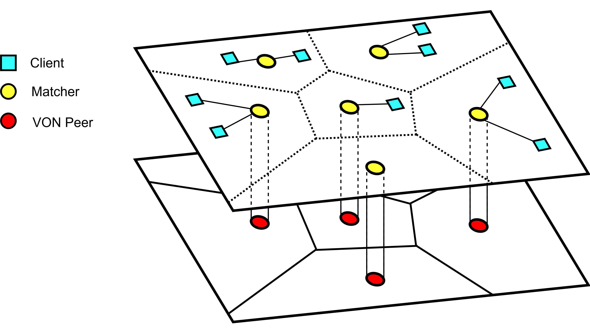

# VAST.js
P2P Spatial Publish and Subscribe built on the Voronoi Overlay Network (VON).  
This documentation is not exhaustive and may not conform to current code 100%.
 
- [VAST.js](#vastjs)
- [Introduction to VAST.js](#introduction-to-vastjs)
    - [Basic Stricture](#basic-structure)
    - [Matchers](#matchers)
    - [Voronoi Overlay Network](#voronoi-overlay-network)
    - [The Global Server](#the-global-server)
- [Dependancies](#dependancies)
- [Getting Started](#getting-started)

# Introduction to VAST.js
## Basic Structure


## Matchers
Clients establish connections to [matchers](./docs/matcher.md) based on their position in the environment. Matchers act as "spatial message brokers", i.e. they are responsible for handling subscription requests from their own clients and for matching publications to subscriptions.
Each matcher keeps a list of all subscriptions of its own clients as well as copies of "ovelapping" subscriptions for clients connected to other matchers.  
  
Matchers are not "aware" of each other and do not have direct connections, instead each matcher has an underlying [VON Peer](./docs/VON.md), which can be used to send any matcher-to-matcher packets with the newly implemented spatial forwarding functions in the VON peer. 

<br/><br/>

## Voronoi Overlay Network
The Voronoi Overlay Network (VON) is a dynamic, self-organising peer-to-peer network that establishes mutual awareness and a TCP socket between each peer and its neighbours in the virtual environment. Each peer maintains a localised Voronoi partition of its enclosing, AoI and boundary neighbours, which is shared between peers to facilitate neighbour discovery as peers join, leave and move around the VE. The VON has been extended to send any message to a point or area in the environment, and each VON peer will only receive the message once.
  
For more detail on the VON, see [VON Peer](./docs/VON.md)

<br/><br/>

## The Global Server
The HTML visualiser requires the global server to function. Each matcher has a connection to the global server and sends updates on its position, its perceived neighbours, clients, etc.
The global server collects all of this localised data and constructs a global understanding of the environments, which is rendered on the html client. The global server does not have any functional purpose in VAST.js and is strictly for debugging and demonstration purposes.  
  
**NOTE: If you wish to use VAST.js without the global server, the "RequireGS" flag must be set to false in matcher.js.**  
If "RequireGS" is set to true, the matcher will not initialise before establishing a connection to the Global Server.  
  

When using the Global Server for visualisation, ensure that you start it before any matchers. You can manually start it from the terminal:
```sh
node ./lib/visualiser/global_server.js
```

<br/><br/>

### Limitations to the Visualiser Imposed by Multithreading
When inspecting the ./lib/visualiser/visualiser.html, you will notice a renderLocal flag. Back when the matcher and VON peer were instantiated in the same process, the matcher was able to send its underlying VON peers neighbour list to the GS, which allowed for the visualiser to display both the global and localised views of the VON. 
When the VON peer was shifted to run in a worker thread, this functionality was lost as no mechanism has been written for the VON peer to exchange this data with its matcher. 
This functionality can be reintroduced by expanding the VON_peer_worker to accept a "get_VON_data" message from its matcher or something similar.  
For now, the renderLocal flag is forced to false in the render function in the visualiser.

<br/><br/>

# Dependancies
## Worker Threads Module
The VON peer runs on a worker thread of the Matcher. Install in the VAST.js directory using:
```sh
npm install worker-threads
``` 

<br/><br/>

## Socket.io and Socket.io-client
Currently, the matcher uses socket.io to establish a WebSocket connection with clients.  
The Global Server also uses Socket.io to establish a connection with each matcher.
Clients and matchers also require the socket.io-client module.  
Install in the VAST.js directory using:
```sh
npm install socket.io
npm install socket.io-client
```

<br/><br/>

# Getting Started
## ./test
The ./test directory contains some basic .js files to start matchers and clients.

## start_GW.js and start_matcher.js
These files start a Gate Way or ordinary matcher at the given coordinates with the given AoI. If these arguments are not specified, the matchers will be placed randomly.  
**NOTE: The hostname for the machine running the gateway is currently specified directly in these files. By default, it listens on port 8000 for VON traffic and 20000 for client sockets**  
Example: Start the Gate Way matcher at {x: 200, y: 600} with an AoI radius of 100:
```sh
node ./test/start_GW.js 200 600 100
```

## new_client.js
This file creates a new client. Currently, this file starts clients, registers them for subscriptions, and makes them publish messages at set intervals.  
This file was unfortunately written for tests performed by CFM specifically, and have not yet been changed for more generalised applications. Use this file as an example to write your own client starter app for your own debugging needs. 

## start_test.js
This file starts the global server and a number of matchers (including a GW) randomly around the environment, each with the same specified AoI. The amount of time to wait between adding each new matcher can also be specified. All matchers are instantiated in a new node process.  
Example: To start 5 matchers (including the gateway), each with an aoi of 100, and a wait time between matchers of 2 seconds
```sh
node ./test/start_test.js 5 100 2000
``` 
