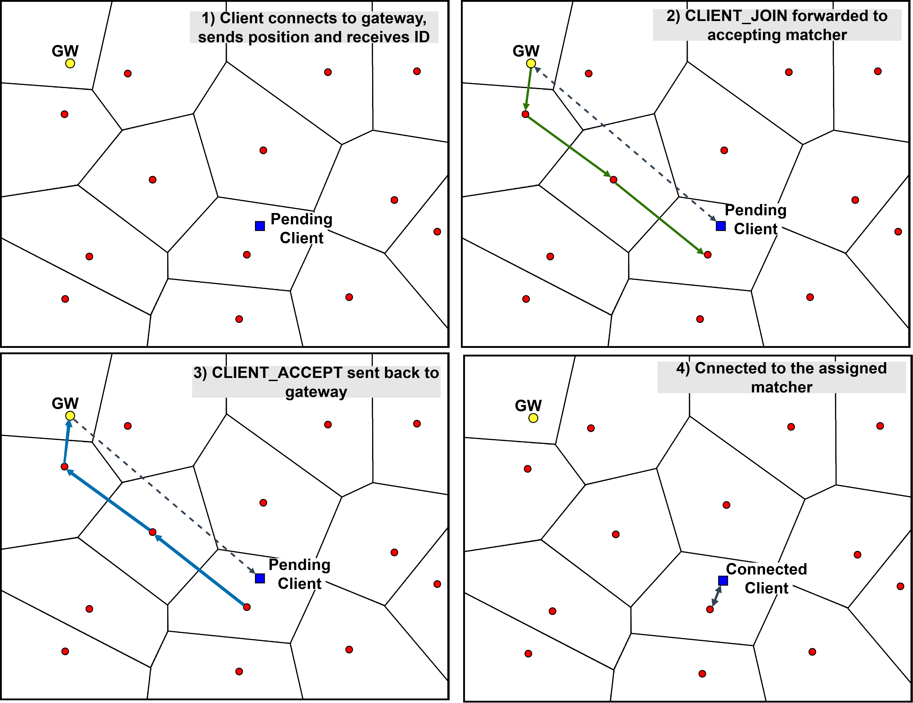
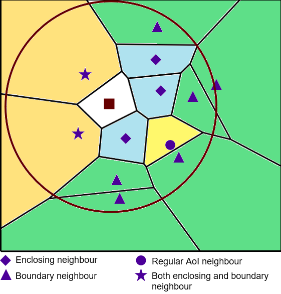

# VON Peer
The underlying P2P network of VAST.js.  
**Clients ARE NOT part of the VON, only matchers are.**
 
- [VON Peer](#von-peer)
- [The Gateway Peer](#the-gateway-peer)
- [Types of Neighbours](#types-of-neighbours)
- [API](#api)
    - [VON packet](#von-packet)
    - [VON Messages](#von-messages)

# The Gateway Peer
The Gateway peer is the first VON peer that joins the VON, and will always have an ID = 1. Each new peer that joins the VON first establishes a connection to the GW and is assigned an ID. Then (in _oversimplified terms_) the join request is greedy-forwarded to the accepting peer, who inserts the joining peer into its voronoi partition and gives the joining peer it's neighbour list. The joining peer contacts all of it's neighbours and they insert the new peer into their own voronoi partitions and _voila_. For a more thourough understanding, refer to "Scalable Peer-to-Peer Networked Virtual Environment, S.Y Hu, 2005" and "VON: A Scalable Peer-to-Peer Network for Virtual Environments, Shun-Yun Hu, Jui-Fa Chen, Tsu-Han Chen, 2006"

# Types of Neighbours
VON defines 3 different types of neighbours: _enclosing neighbours, AoI neighbours and boundary neighbours_.  
An _enclosing neighbour_ is a neighbour who shares a boundary with a peer’s region in the Voronoi diagram. An _AoI neighbour_ is any neighbour whose site lies within the peer’s Area of Interest (AoI). A _boundary neighbour_ is an enclosing or AoI neighbour whose region intersects the boundary of a peer’s AoI.  

# API
## VON Packet
The packets sent between VON peers are defined in ./lib/types.js as packs.

| Property      | Description |
| -----------   | ----------- |  
| type          | The type of [VON Message](von-messages) |
| msg           | The message content |
| priority      | The priotity of this packet (currently has no effect) |
| targets       | Array of each VON peer ID this packet should be sent to|
| src           | The VON peer who sent this packet |

---
  

## VON Messages
These are an enumeration that specify the type of message that one peer is sending to another (or itself).  
This is declared in ./lib/common.js  

| Message       | Description   |
| -----------   | -----------   |
| VON_BYE       | VON's disconnect |
| VON_PING      | VON's PING to check if a neighbour is still alive (currently not used?) |
| VON_QUERY     | VON's query to find an accepting peer for a given point |
| VON_JOIN      | VON's Join to learn of initial neighbours |
| VON_NODE      | VON's notification of new nodes   |
| VON_HELLO     | VON's greeting to newly learned node to be mutually aware |
| VON_HELLO_R   | VON's response to VON_HELLO |
| VON_EN        | VON's enclosing neighbour enquiry, to determine if my EN list is complete |
| VON_MOVE      | VON's move to notify AoI neighbours of new/current position |
| VON_MOVE_F    | VON's move, full notification of AoI |
| VON_MOVE_B    | VON's move for boundary neighbours |
| VON_MOVE_FB   | VON's move for boundary neighbours with full notification on AoI |
| MATCHER_POINT | Matcher Message to be sent to point over VON  |
| MATCHER_AREA  | Matcher Message to be sent to area over VON |

---
    